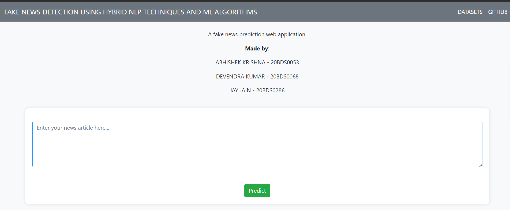
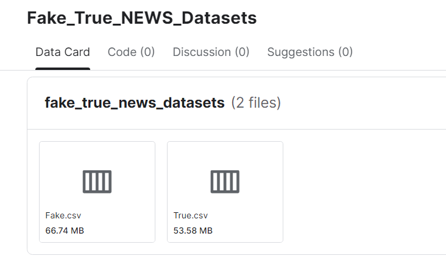

## Capstone Project [Final-Year Project]

# Fake News Detection Using Hybrid NLP Techniques And ML Algorithms

A web application for fake news prediction.

# To Run:
- Download this github-repo files and the datasets (true.csv & false.csv)
- Open VSCode and run the "app.py" [ python app.py ]
- Click on the localhost address given by the output-terminal

Datasets used: https://www.kaggle.com/datasets/abkrishna05/fake-true-news-datasets

### Made by:
  1. Abhishek Krishna (20BDS0053)
  2. Devendra Kumar (20BDS0068)
  3. Jay Jain (20BDS0286)
